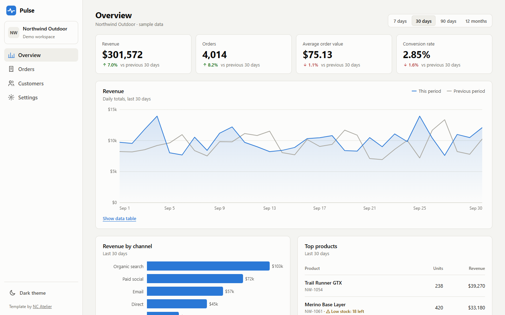
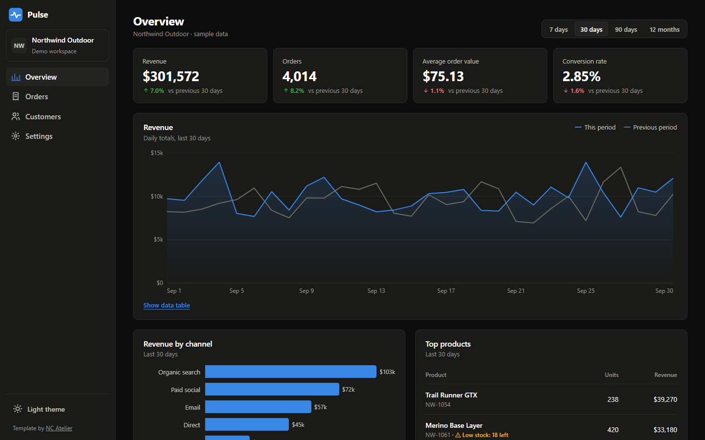

# Pulse: Analytics Dashboard Template

A clean sales analytics dashboard for SaaS, e-commerce and internal tools. Built with [Nuxt](https://nuxt.com) (Vue), with light and dark themes, sortable tables and CSV export. Charts are lightweight SVG components with no chart library. Generates a static site, so it can be hosted anywhere.





> **All data is fictional.** "Northwind Outdoor", its orders, customers and figures are generated from a fixed seed in `app/utils/data.ts`.

## Pages

| Page | What's on it |
|---|---|
| **Overview** | Date-range presets, KPI tiles with change vs previous period, revenue chart compared with the previous period (with a data-table view), revenue by channel, top products, recent orders |
| **Orders** | Search, status filters, sortable columns, pagination, CSV export of the filtered rows |
| **Customers** | Summary figures, search and a sortable customer table |
| **Settings** | Theme (system / light / dark), report email with validation, currency and alert preferences |

## Features

- **Light and dark themes**: follows the device by default, remembers the user's choice, no flash on load.
- **Accessible charts**: one axis per chart, legends, hover tooltips, colour-blind-safe colours, and a data table for every chart.
- **Status badges** that pair colour with an icon and a label, never colour alone.
- **Responsive**: sidebar becomes a menu on phones; less important table columns hide so status and totals stay visible.
- **Fast**: system fonts, static HTML, hand-built SVG charts (no chart library).

## Run it locally

Requires Node.js 22.19 or later.

```bash
npm install
npm run dev
```

Open http://localhost:3000.

## Connect your own data

All numbers come from `app/utils/data.ts`. Replace the generated arrays (`DAILY`, `ORDERS`, `CUSTOMERS`) and the `topProducts` function with data from your API, database or analytics tool. Two common approaches:

1. **Fetch at build time** in the page files, for reports that update daily (rebuild on a schedule).
2. **Fetch in the browser** from your API, for live numbers (add authentication in front of the dashboard).

## Customise

| What | Where |
|---|---|
| Colours (light and dark), chart colours | CSS variables at the top of `app/assets/css/main.css` |
| Navigation and workspace name | `app/app.vue` |
| Charts | `app/components/RevenueChart.vue`, `app/components/ChannelChart.vue` |
| Table columns | `COLUMNS` in `app/pages/orders.vue` and `app/pages/customers.vue` |
| Date ranges | `RANGES` in `app/utils/data.ts` |
| Icons | `app/utils/icons.ts` |

## Deploy to Cloudflare Pages

`npm run build` runs `nuxt generate`, which pre-renders every page into a plain static site in `.output/public/`. Preview it with `npm run preview`.

- **Dashboard:** Workers & Pages → Create → Pages → Connect to Git → pick this repo. Build command: `npm run build`. Output directory: `.output/public`.
- **CLI:**
  ```bash
  npm run build
  npx wrangler pages deploy .output/public --project-name pulse-dashboard
  ```

For a real dashboard, put it behind authentication (for example Cloudflare Access) before connecting live data.

## Credits

- Built with [Nuxt](https://nuxt.com) (MIT).
- Built by **NC Atelier**.

---

### Want a dashboard like this for your business?

NC Atelier designs and builds fast, accessible websites and web apps for businesses in the UK, US and Canada.

**Contact:** _add your email / LinkedIn here_
